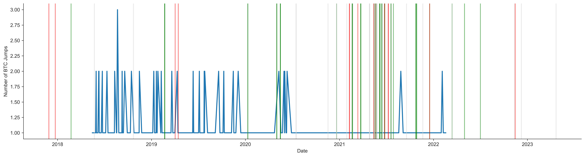
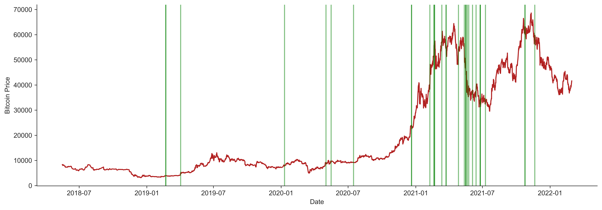
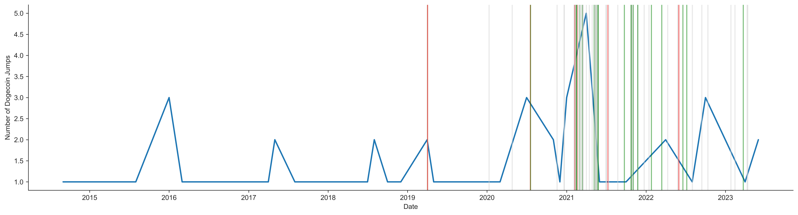
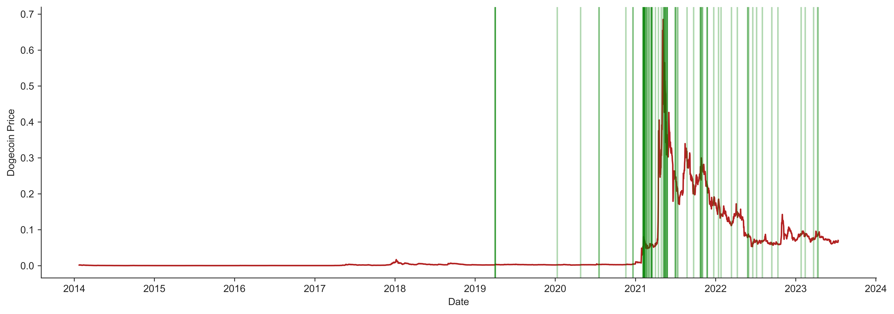

[](http://quantlet.de/)

## [](http://quantlet.de/) **Jump Detection** [](http://quantlet.de/)

```yaml

Name of QuantLet : 'Jump Detection'

Published in : 'DEDA_class_SoSe2023'

Description : 'Detecting jumps in prices of cryptocurrencies Bitcoin and Dogecoin using historical CC price data from Kaggle. Lee and Mykland (2012) method is used.'

Keywords : 'BTC, Bitcoin, Dogecoin, Twitter, tweets, cryptocurrency, cryptocurrencies, jumps, jump detection, time series, Lee, Mykland, digital assets, price movement'

Authors : 'Margarita Tavkazakova, Maral Togtokhbaatar'

Submitted : 'July 17 2023 by Margarita Tavkazakova and Maral Togtokhbaatar'

```









