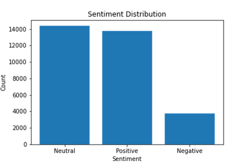

[](http://quantlet.de/)

## [](http://quantlet.de/) **Sentiment Analysis** [](http://quantlet.de/)

```yaml

Name of QuantLet : 'Sentiment Analysis'

Published in : 'DEDA_class_SoSe2023'

Description : 'Using the Python module TextBlob the sentiment of Elon Msuk tweets are analysed'

Keywords : 'Sentiment, Textblob, BTC, Bitcoin, Dogecoin, Twitter, tweets, cryptocurrency, cryptocurrencies'

Authors : 'Margarita Tavkazakova, Maral Togtokhbaatar'

Submitted : 'July 17 2023 by Margarita Tavkazakova and Maral Togtokhbaatar'

```



### [IPYNB Code: Sentiment Analysis.ipynb](Sentiment Analysis.ipynb)


automatically created on 2023-07-22