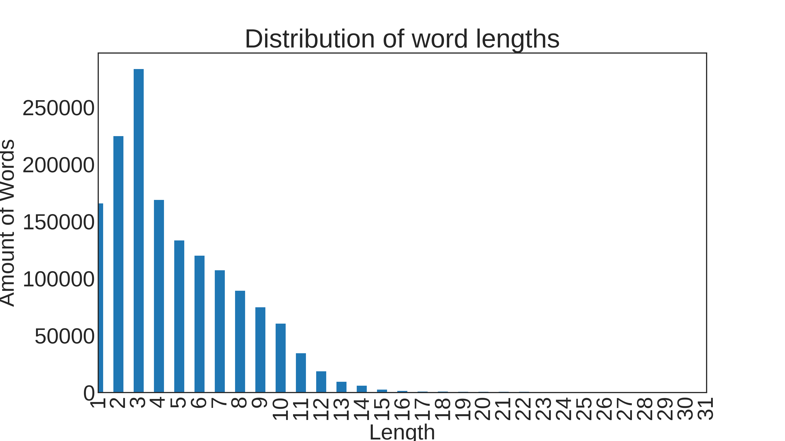
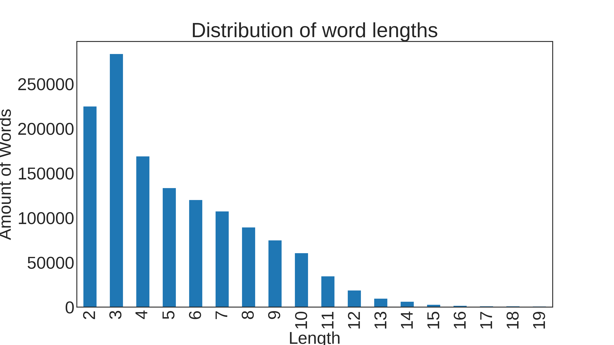
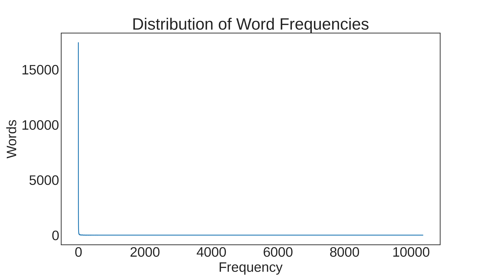

[](http://quantlet.de/)

## [](http://quantlet.de/) **LDA_MSc_2_Preprocessing** [](http://quantlet.de/)

```yaml

Name of Quantlet: 'LDA_MSc_2_Preprocessing' 

Published in: 'DEDA_class_SoSe2023'

Description: 'Extracts text data from PDF-stored theses and cleans from non-alphabetic characters, stopwords, single letters and rare words. Corresponding plots for each step of cleaning text data are also produced.'

Keywords: 'plots, natural language processing, stopwords, nltk, re, regex, object-oriented programming'

Author: 'Timur Tenishev, Bachana Anasashvili, Yaman Tanilkan'

See also:  1) LDA_MSc_2_Preprocessing.ipynb
           2) lang_detect.py
           3) text_prep.py
```









### [IPYNB Code: LDA_MSc_2_Preprocessing.ipynb](LDA_MSc_2_Preprocessing.ipynb)


automatically created on 2023-07-22