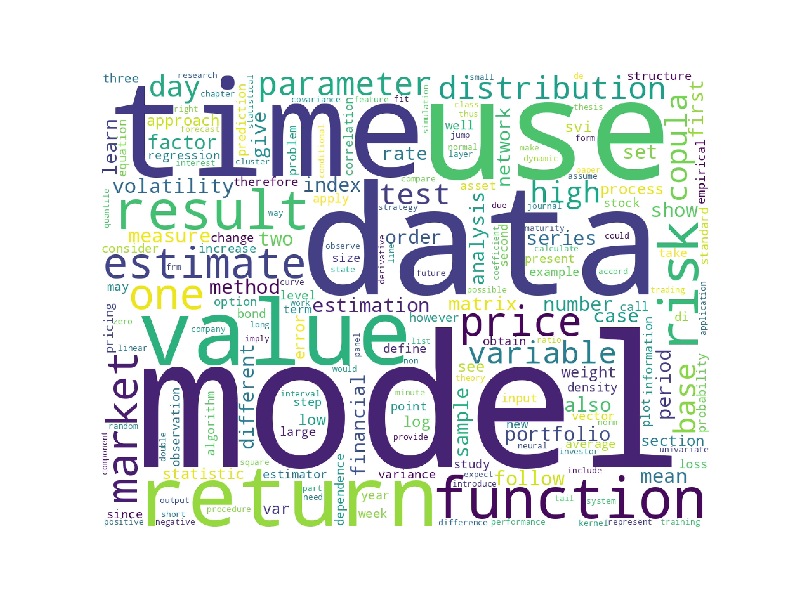

[](http://quantlet.de/)

## [](http://quantlet.de/) **LDA_MSc_3_Making_Corpus** [](http://quantlet.de/)

```yaml

Name of Quantlet: 'LDA_MSc_3_Making_Corpus' 

Published in: 'DEDA_class_SoSe2023'

Description: 'Extracts text data from filtered TXT-stored theses, builds corpus for later topic modeling and plots wordcloud with UMAP-visualizations of terms and documents.'

Keywords: 'plots, natural language processing, wordcloud, umap, corpus, object-oriented programming'

Author: 'Timur Tenishev, Bachana Anasashvili, Yaman Tanilkan'

See also:  1) LDA_MSc_3_Making_Corpus.ipynb
           2) corpus_maker.py
```




### [IPYNB Code: LDA_MSc_3_Making_Corpus.ipynb](LDA_MSc_3_Making_Corpus.ipynb)


automatically created on 2023-08-03