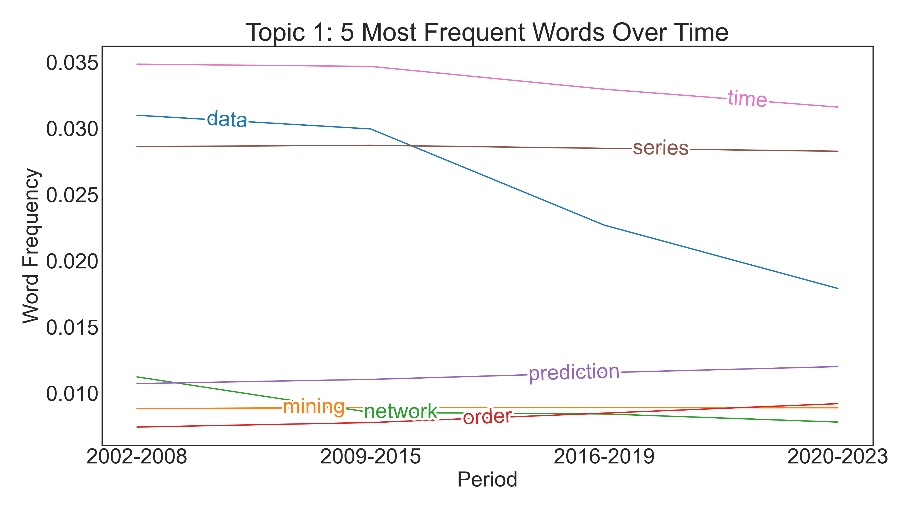
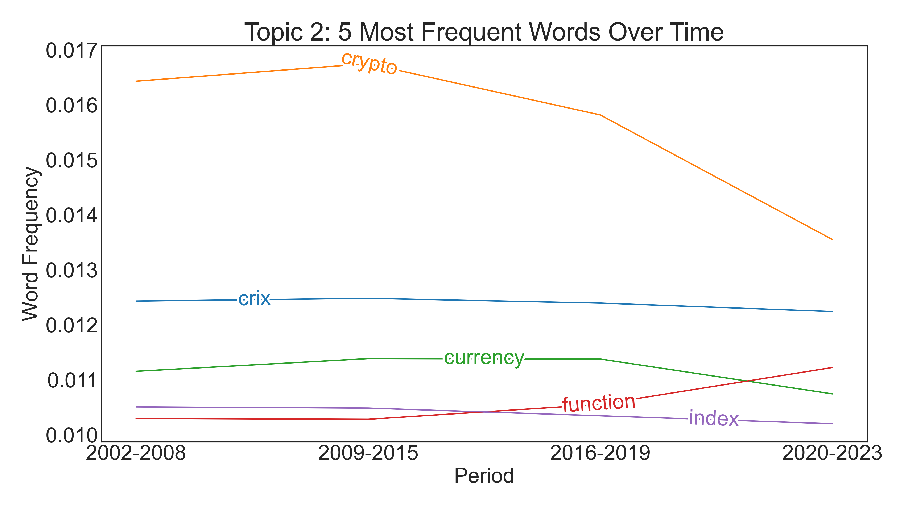
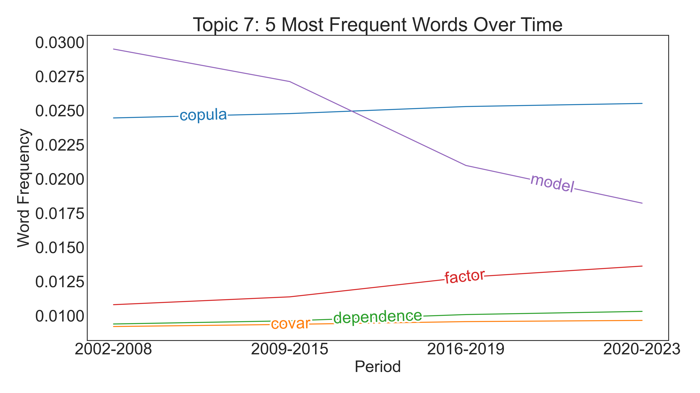
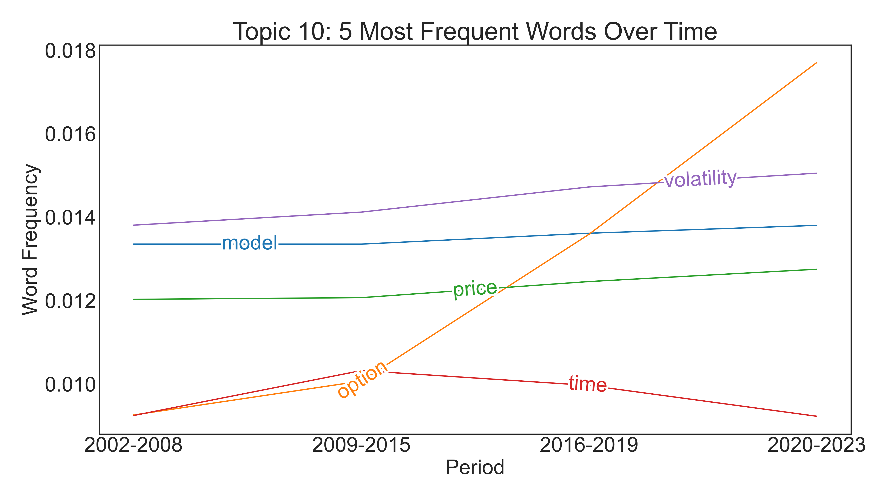
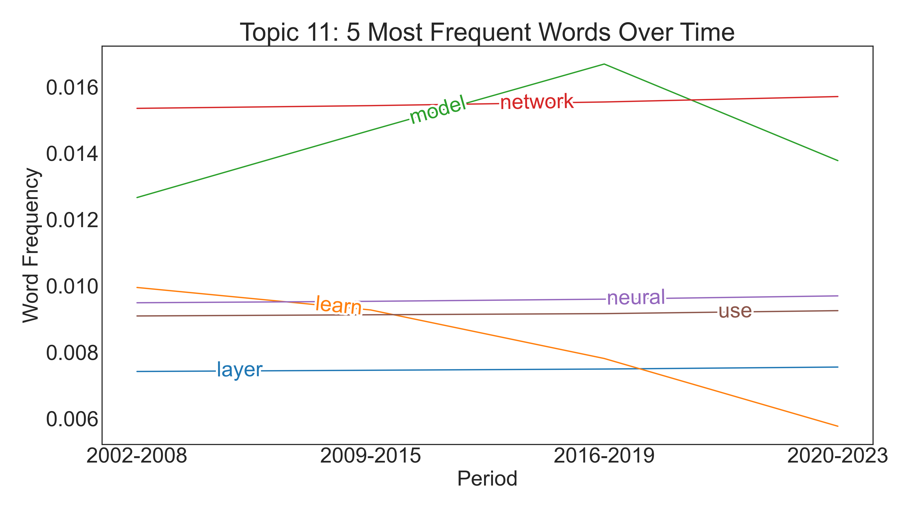

[](http://quantlet.de/)

## [](http://quantlet.de/) **LDA_MSc_4_Topic_Modeling** [](http://quantlet.de/)

```yaml

Name of Quantlet: 'LDA_MSc_4_Topic_Modeling' 

Published in: 'DEDA_class_SoSe2023'

Description: 'Builds LDA and DTM models based on the corpus of LvB MSc Theses. Also performs gridsearch over the number of topics, alpha and beta parameters of Dirichlet document-topic and topic-term distributions respectively for picking the best models. Intertopic distance map, UMAP-projections for terms and theses coloured by topics, and topic evolution graphs are created as a result.'

Keywords: 'plots, corpus, UMAP, topic modeling, lda, dtm, dirichlet, object-oriented programming'

Author: 'Timur Tenishev, Bachana Anasashvili, Yaman Tanilkan'

See also:  1) LDA_MSc_4_Topic_Modeling.ipynb
           2) LDA_with_Grid.py
           3) umap_colourizer.py
```















### [IPYNB Code: LDA_MSc_4_Topic_Modeling.ipynb](LDA_MSc_4_Topic_Modeling.ipynb)


automatically created on 2023-08-03