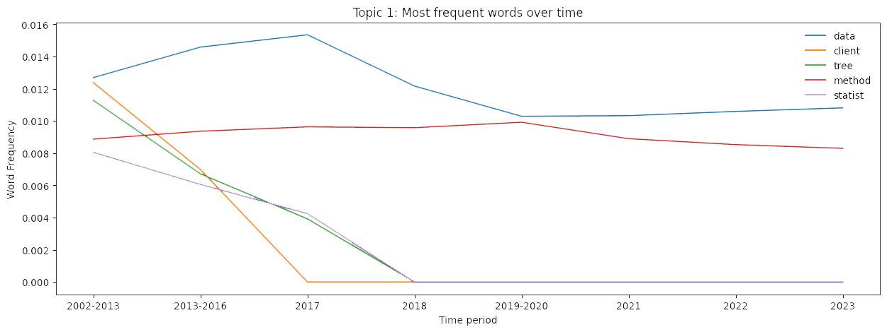
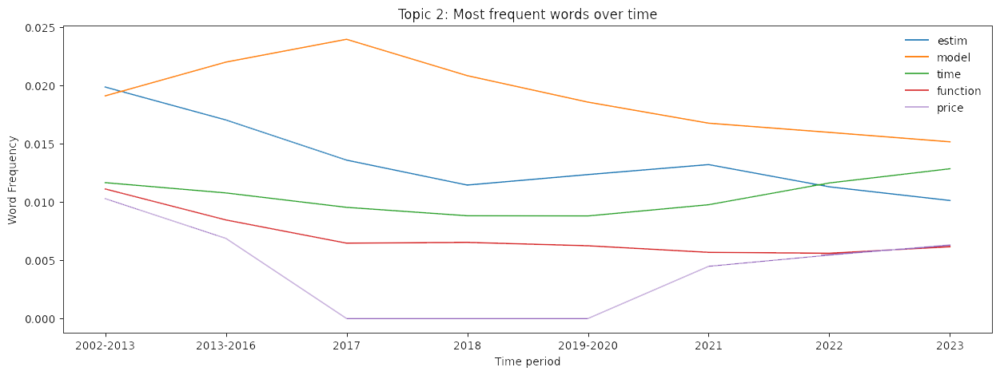
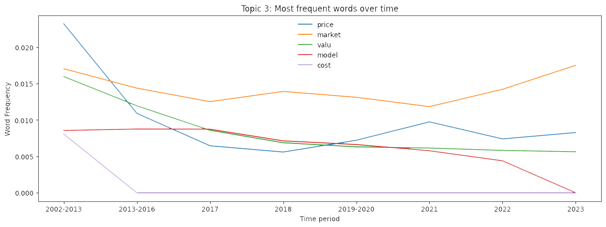

[](http://quantlet.de/)

## [](http://quantlet.de/) **DEDA_class_SoSe2023_LDA_PhD_Theses** [](http://quantlet.de/)

```yaml

Name of QuantLet: DEDA_class_SoSe2023_LDA_PhD_Theses

Published in: DEDA Class SoSe2023

Description: Applies LDA and DTM on LvB Ph.D theses following automated pre-processing. The results are visuzalizations of topic distributions and their evolution over time.

Keywords: latent dirichlet allocation, dynamic topic modeling, topic modeling, plots, natural language processing

Author: Julius Freidank, Teng Teng, Raul Cristian Bag

Submitted: Monday, 10 of July 2023 by Raul Cristian Bag

```

# Applies LDA and DTM on LvB Ph.D theses following automated pre-processing. The results are visuzalizations of topic distributions and their evolution over time.

## Evolution of the 1. topic

## Evolution of the 2. topic

## Evolution of the 3. topic

