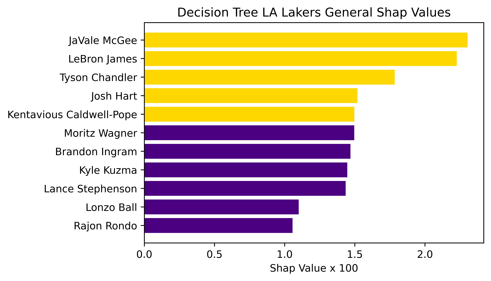
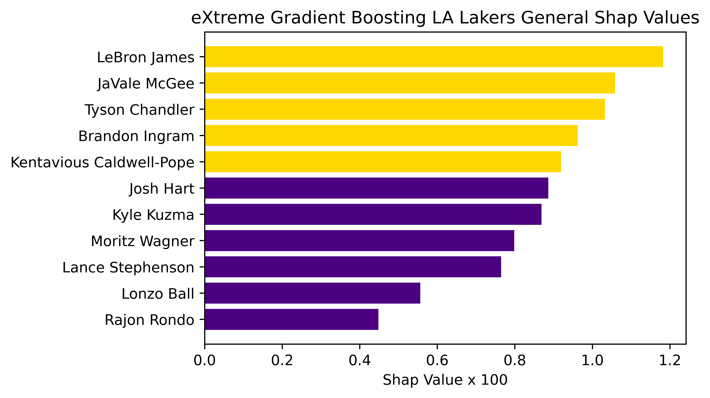
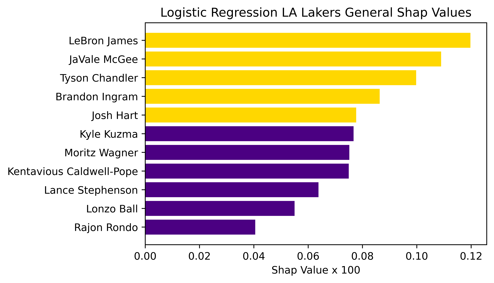
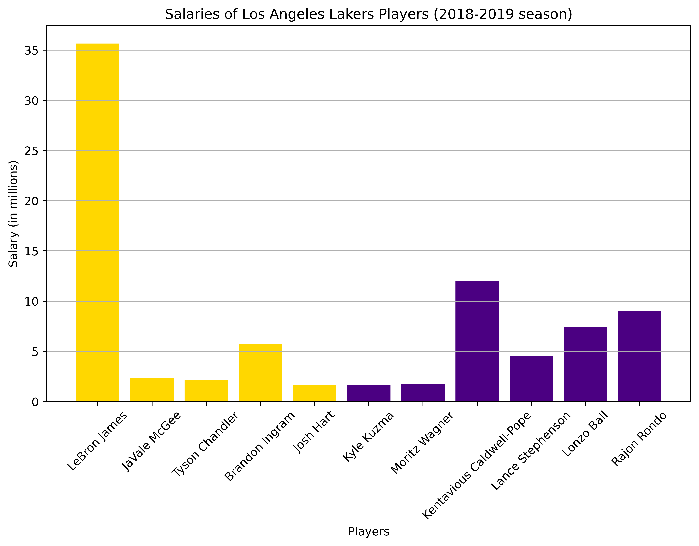

[](http://quantlet.de/)

## [](http://quantlet.de/) **DEDA_SoSe23_HU_NBA_SHAP_Graphical_Evaluation_SHAP_NBA** [](http://quantlet.de/)

```yaml


Name of Quantlet: 'DEDA_SoSe23_HU_NBA_SHAP_Graphical_Evaluation_SHAP_NBA'

Published in: 'DEDA class SoSe2023'

Description: 'Graphical analysis of the resulting SHAP values for the active Lakers roster of 2018/19. Illustrations coded in matplotlib'

Keywords: 'Matplotlib, visual analysis, comparison, graphical representation, evaluation'

Author: 'Oliver Klatt Tustanowski, Jannic Horst, Tobias Klein'

Datafile: 'log_reg_shap_lakers_18_19.csv, dec_tree_shap_lakers_18_19.csv, xgbcl_shap_lakers_18_19.csv '


```









### [IPYNB Code: DEDA_SoSe23_HU_NBA_SHAP_Graphical_Evaluation_SHAP_NBA.ipynb](DEDA_SoSe23_HU_NBA_SHAP_Graphical_Evaluation_SHAP_NBA.ipynb)


automatically created on 2023-07-25