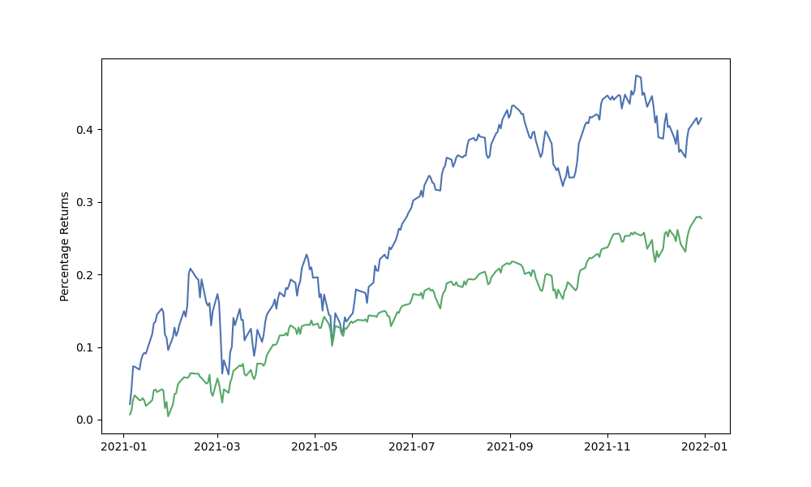

[](http://quantlet.de/)

## [](http://quantlet.de/) **PFM_using_Markowitz** [](http://quantlet.de/)

```yaml

Name of QuantLet: PFM_using_Markowitz

Published in: DEDA Class SoSe2023

Description: Optimizing investment portfolios by analyzing the risk and return characteristics of different assets. By employing the Markowitz model, we provide a quantitative approach to portfolio diversification and asset allocation, aiming to maximize returns while minimizing risk.

Keywords: Portfolio management, Markowitz model, asset allocation, diversification, risk-return analysis, investment optimization

Author: Ruchir Dhiman, Bhavya Goyal, Jonas Saleh

Submitted: Tuesday, 11 of July 2023 by Bhavya Goyal

```

# Optimizing investment portfolios by analyzing the risk and return characteristics of different assets. By employing the Markowitz model, we provide a quantitative approach to portfolio diversification and asset allocation, aiming to maximize returns while minimizing risk.




