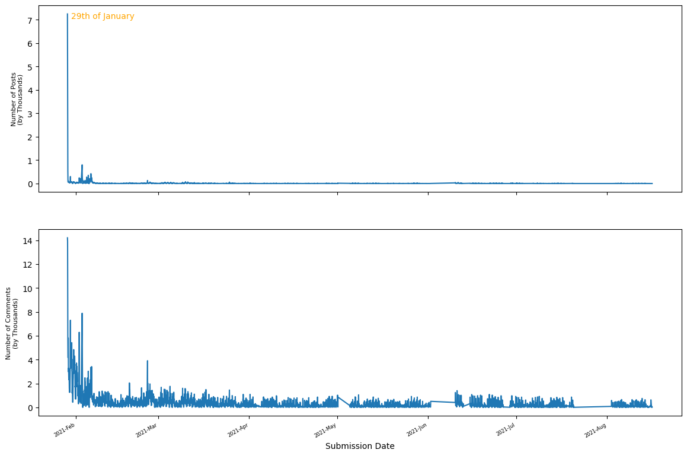

[](http://quantlet.de/)

## [](http://quantlet.de/) **RedditWSBSentiment** [](http://quantlet.de/)

```yaml

Name of QuantLet: RedditWSBSentiment

Published in: DEDA Class SoSe2023

Description: Cross Correlation Analysis of Sentiment from Posts and Comments in the subreddit r/wallstreetbets and GME and AMC stocks during the Gamestop short squeeze of 2021.

Keywords: sentiment analysis, nlp, financial, volatility, return, asset, web scrapping, social media, reddit

Author: Antonio Alvarez, Rodion Frolov, Ozan Ayhan

Submitted: Monday, 10 of July 2023 by Antonio Alvarez

```

# Cross Correlation of the Sentiment in r/wallstreetbets and GME and AMC stocks during the Gamestop short squeeze



## Objective
Analyze the potential correlation between GME and AMC stock with Reddit posts and comments using Sentiment and Cross 
Correlation Analysis


## Get Started
In order to reproduce the whole repo, make sure to comply with Reddit API Requirements and have your client id, 
client secret and user name on a `config.yml` file. 
In our case, it is called `config-personal.yml` and it is in the parent directory. Create a `data` directory with a 
`comments` directory as well.

The posts data can be found on this [Kaggle Repository](https://www.kaggle.com/datasets/gpreda/reddit-wallstreetsbets-posts?resource=download).

## Reproduction
To reproduce the main findings and get the processed data, please refer to `Reddit_WSB.sh` to run the files sequentially.
Read the comments!

For the frequency plots and checks on stationarity for the stock data, please refer to the `notebooks` folder.
